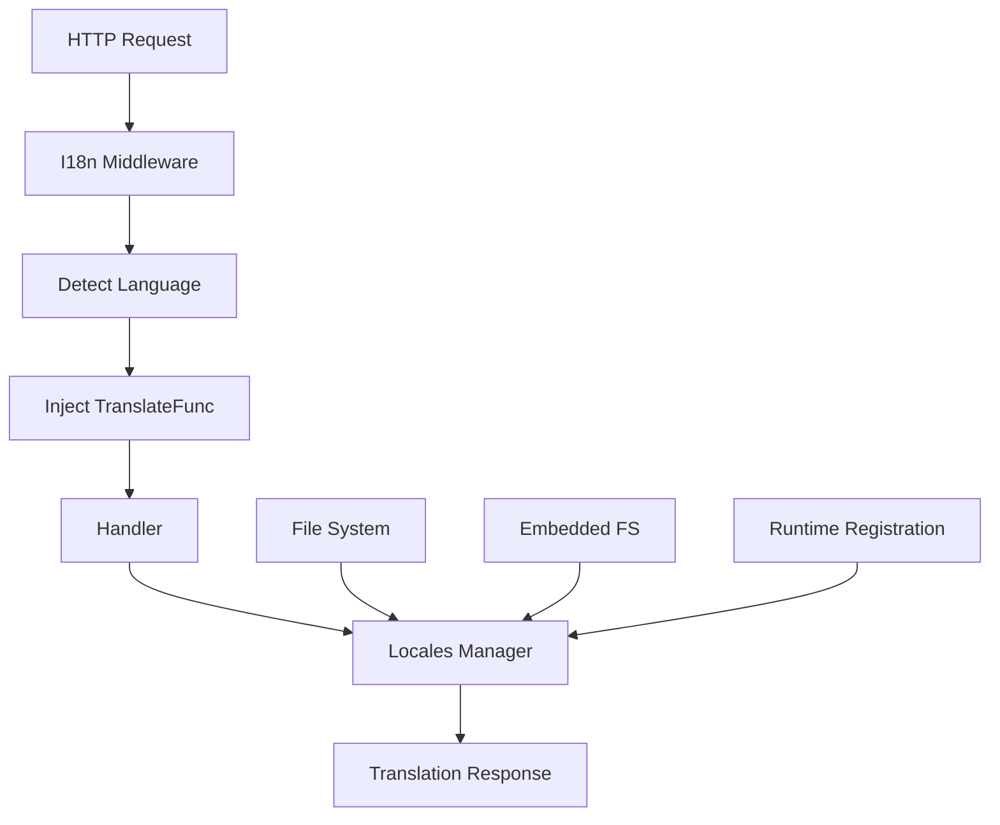

# Locales Service Provider Documentation

Chào mừng đến với tài liệu của **Locales Service Provider** - một giải pháp quản lý đa ngôn ngữ (i18n) chuyên nghiệp cho ứng dụng Go.

## 🎯 Mục tiêu chính

Service Provider này được thiết kế theo nguyên tắc **Single Responsibility Principle**, tập trung vào:

- ✅ **Quản lý loader translations** từ nhiều nguồn khác nhau
- ✅ **Truy xuất message** với hiệu suất cao và thread-safe
- ✅ **Module-based translations** cho kiến trúc microservices
- ❌ **Không** xử lý HTTP request logic (thuộc về middleware)

## 📚 Tài liệu

### Core Documentation
- **[Overview](overview.md)** - Tổng quan về kiến trúc và nguyên tắc thiết kế
- **[Manager](manager.md)** - API reference và usage examples  
- **[Config](config.md)** - Configuration guide và best practices
- **[Loader](loader.md)** - Loading strategies và file formats

### Quick Start

#### 1. Cài đặt
```bash
go get github.com/Fork/providers/locales
```

#### 2. Cấu hình cơ bản
```yaml
# config/app.yaml
locales:
  default_locale: "en"
  locales_directory: "locales"
  supported_locales:
    - "en"
    - "vi"
  bundle: "message"
```

#### 3. Khởi tạo Manager
```go
package main

import (
    "github.com/Fork/providers/locales"
)

func main() {
    config := locales.DefaultConfig()
    config.DefaultLocale = "vi"
    config.SupportedLocales = []string{"en", "vi", "fr"}
    
    manager := locales.NewManager(config)
    
    // Load translations
    err := manager.LoadTranslations("./locales", nil)
    if err != nil {
        panic(err)
    }
    
    // Sử dụng
    msg := manager.Translate("vi", "welcome", map[string]interface{}{
        "name": "John",
    })
    
    fmt.Println(msg) // "Chào mừng John"
}
```

#### 4. Tạo translation files
```json
// locales/vi.json
{
  "welcome": "Chào mừng {{.name}}",
  "auth": {
    "login": "Đăng nhập",
    "logout": "Đăng xuất"
  }
}

// locales/en.json  
{
  "welcome": "Welcome {{.name}}",
  "auth": {
    "login": "Login", 
    "logout": "Logout"
  }
}
```

## 🔧 API Overview

### Core Translation Methods
```go
// Dịch trực tiếp
msg := manager.Translate("vi", "welcome", map[string]interface{}{
    "name": "John",
})

// Tạo function cho ngôn ngữ cụ thể
viTranslate := manager.TranslateFunc("vi")
msg1 := viTranslate("auth.login", nil)
msg2 := viTranslate("auth.logout", nil)
```

### Loading Methods
```go
// Load từ file system
manager.LoadTranslations("./locales", nil)

// Load từ embedded FS
//go:embed locales/*.json
var localesFS embed.FS
manager.LoadEmbeddedTranslations(localesFS, "locales")

// Runtime registration cho modules
manager.RegisterTranslations("auth", map[string]map[string]string{
    "en": {"login": "Login"},
    "vi": {"login": "Đăng nhập"},
})
```

## 🏗️ Kiến trúc

### Tách biệt trách nhiệm



### Component Responsibilities

| Component | Responsibility |
|-----------|----------------|
| **Locales Manager** | Load translations, cache localizers, translate messages |
| **HTTP Middleware** | Detect language from request (Accept-Language, query, cookie) |
| **Config** | Configuration management for loading sources |
| **Loader** | File system and embedded FS loading strategies |

## 🎨 Usage Patterns

### 1. Web Application với Gin
```go
// Middleware
func I18nMiddleware(manager locales.Manager) gin.HandlerFunc {
    return func(c *gin.Context) {
        lang := detectLanguage(c) // từ header, query, cookie
        translateFunc := manager.TranslateFunc(lang)
        c.Set("translate", translateFunc)
        c.Next()
    }
}

// Handler
func GetUser(c *gin.Context) {
    translate := c.MustGet("translate").(func(string, map[string]interface{}) string)
    
    message := translate("user.not_found", map[string]interface{}{
        "id": userID,
    })
    
    c.JSON(404, gin.H{"error": message})
}
```

### 2. CLI Application
```go
func main() {
    manager := locales.NewManager(config)
    
    // Detect từ system locale hoặc flag
    lang := detectSystemLanguage()
    translate := manager.TranslateFunc(lang)
    
    fmt.Println(translate("app.welcome", nil))
    fmt.Println(translate("help.usage", nil))
}
```

### 3. Microservices với Module Registration
```go
// Auth service
func (s *AuthService) RegisterTranslations(manager locales.Manager) {
    manager.RegisterTranslations("auth", map[string]map[string]string{
        "en": {
            "invalid_token": "Invalid authentication token",
            "expired_token": "Token has expired",
        },
        "vi": {
            "invalid_token": "Token xác thực không hợp lệ",
            "expired_token": "Token đã hết hạn",
        },
    })
}

// Sử dụng
errMsg := manager.Translate(userLang, "auth.invalid_token", nil)
```

## 🚀 Performance Features

- **Localizer Caching**: Mỗi ngôn ngữ có một cached localizer
- **Lazy Loading**: Localizer chỉ được tạo khi cần thiết  
- **Thread Safe**: Concurrent access với RWMutex
- **Fallback Strategy**: Graceful degradation khi thiếu translation
- **Memory Efficient**: Chỉ cache những gì thực sự được sử dụng

## 📦 Loading Strategies

### 1. File System Loading
```
locales/
├── en.json
├── vi.json
├── fr.json
└── es.json
```

### 2. Embedded FS Loading
```go
//go:embed locales/*.json
var localesFS embed.FS

// Tự động load khi NewManager
config.EmbeddedFS = &localesFS
config.EmbeddedPath = "locales"
```

### 3. Runtime Registration
```go
// Cho plugin systems
plugin.RegisterTranslations(manager, pluginTranslations)
```

## 🔄 Migration Guide

### Từ phiên bản cũ

#### API Changes
```go
// Cũ ❌
manager.Get(key, args, locales...)
manager.MustGet(key, args, locales...)

// Mới ✅
manager.Translate(lang, key, args)
manager.TranslateFunc(lang)(key, args)
```

#### Config Changes  
```yaml
# Cũ ❌ - Mixed concerns
locales:
  default_locale: "en"
  accept_language: true
  query_param: "lang"

# Mới ✅ - Separated concerns
locales:
  default_locale: "en"
  locales_directory: "locales"
  
http:
  middleware:
    i18n:
      accept_language: true
      query_param: "lang"
```

## 🧪 Testing

### Unit Testing
```go
func TestTranslate(t *testing.T) {
    config := locales.DefaultConfig()
    manager := locales.NewManager(config)
    
    // Register test translations
    manager.RegisterTranslations("test", map[string]map[string]string{
        "en": {"hello": "Hello {{.name}}"},
        "vi": {"hello": "Xin chào {{.name}}"},
    })
    
    // Test translation
    result := manager.Translate("vi", "test.hello", map[string]interface{}{
        "name": "John",
    })
    
    assert.Equal(t, "Xin chào John", result)
}
```

### Integration Testing
```go
func TestWithEmbeddedFS(t *testing.T) {
    //go:embed testdata/locales/*.json
    var testFS embed.FS
    
    config := &locales.Config{
        DefaultLocale: "en",
        EmbeddedFS:    &testFS,
        EmbeddedPath:  "testdata/locales",
    }
    
    manager := locales.NewManager(config)
    // Test embedded loading...
}
```

## 📝 Best Practices

### 1. Key Organization
```json
{
  "auth": {
    "login": "Login",
    "register": "Register"
  },
  "validation": {
    "required": "This field is required",
    "email": "Invalid email format"
  }
}
```

### 2. Parameter Templates
```json
{
  "user": {
    "welcome": "Welcome {{.name}}, you have {{.count}} messages",
    "profile": "{{.name}}'s Profile ({{.role}})"
  }
}
```

### 3. Module Registration Pattern
```go
// Trong package
func RegisterTranslations(manager locales.Manager) {
    manager.RegisterTranslations("module_name", translations)
}

// Trong main app
module.RegisterTranslations(localesManager)
```

### 4. Error Handling
```go
// Graceful fallback
msg := manager.Translate(lang, key, args)
if msg == key {
    // Translation not found, use default
    msg = manager.Translate("en", key, args)
}
```

## 🔗 Related Documentation

- **[Go-i18n Package](https://github.com/nicksnyder/go-i18n)** - Underlying i18n library
- **[BCP 47 Language Tags](https://tools.ietf.org/html/bcp47)** - Language code standards
- **[JSON Schema](https://json-schema.org/)** - Translation file format validation

## 📞 Support

- **Issues**: [GitHub Issues](github.com/go-fork/providers/issues)
- **Discussions**: [GitHub Discussions](github.com/go-fork/providers/discussions)
- **Documentation**: [GitHub Wiki](github.com/go-fork/providers/wiki)

---

*Last updated: June 2, 2025*
